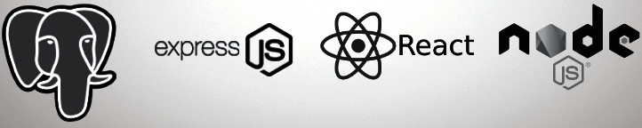

<!-- Improved compatibility of back to top link: See:  -->
<!-- https://github.com/othneildrew/Best-README-Template/pull/73 -->

<a id="readme-top"></a>

<!--
*** Thanks for checking out the Best-README-Template. If you have a suggestion
*** that would make this better, please fork the repo and
*** create a pull requestor simply open an issue with the tag "enhancement".
*** Don't forget to give the project a star! Thanks again!
*** Now go create something AMAZING! :D
-->

<!-- PROJECT SHIELDS -->
<!--
*** I'm using markdown "reference style" links for readability.
*** Reference links are enclosed in brackets [ ] instead of parentheses ( ).
*** See the bottom of this document for the declaration of the reference variables
*** for contributors-url, forks-url, etc.
*** This is an optional, concise syntax you may use.
*** https://www.markdownguide.org/basic-syntax/#reference-style-links
-->

[![Contributors][contributors-shield]][contributors-url]
[![Forks][forks-shield]][forks-url]
[![Stargazers][stars-shield]][stars-url]
[![Issues][issues-shield]][issues-url]
[![project_license][license-shield]][license-url]
[![LinkedIn][linkedin-shield]][linkedin-url]

<!-- PROJECT LOGO -->
<br />
<div align="center">
  <a href="https://github.com/university-of-toronto-fsf/fullstack-pern">
    
  </a>

<h3 align="center">Fullstack PERN Example</h3>
  <p align="center">
    This is an example of a simple fullstack PERN project demonstrating CRUD functionality.
    <br />
    <a href="https://github.com/university-of-toronto-fsf/fullstack-pern">
      <strong>Explore the docs »</strong>
    </a>
    <br />
    <br />
&middot; <a href="#">View Demo</a>

&middot; [Report Bug][bug-report-link]

&middot; [Request Feature][request-feature-link]

  </p>
</div>

<!-- TABLE OF CONTENTS -->
<details>
  <summary>Table of Contents</summary>
  <ol>
    <li>
      <a href="#about-the-project">About The Project</a>
      <ul>
        <li><a href="#built-with">Built With</a></li>
      </ul>
    </li>
    <li>
      <a href="#getting-started">Getting Started</a>
      <ul>
        <li><a href="#prerequisites">Prerequisites</a></li>
        <li><a href="#installation">Installation</a></li>
      </ul>
    </li>
    <li><a href="#usage">Usage</a></li>
    <li><a href="#roadmap">Roadmap</a></li>
    <li><a href="#contributing">Contributing</a></li>
    <li><a href="#license">License</a></li>
    <li><a href="#contact">Contact</a></li>
    <li><a href="#acknowledgments">Acknowledgments</a></li>
  </ol>
</details>

<!-- ABOUT THE PROJECT -->

## About The Project

[![Product Name Screen Shot][product-screenshot]](https://example.com)

This project demonstrates mock CRUD functionality, logging in and receiving a
JSON Web Token for authentication (JWT), and using the JWT to validate your access
across various URIs associated with the website application.

Here's a blank template to get started. To avoid retyping too much info,
do a search and replace with your text editor for the following:

- `university-of-toronto-fsf`,
- `fullstack-pern`,
- `twitter_handle`,
- `linkedin_username`,
- `email_client`,
- `email`,
- `project_title`,
- `project_description`,
- `project_license`

<p align="right">(<a href="#readme-top">back to top</a>)</p>

### Built With

[//]: # '- [![Next][Next.js]][Next-url]'
[//]: # '- [![Vue][Vue.js]][Vue-url]'
[//]: # '- [![Angular][Angular.io]][Angular-url]'
[//]: # '- [![Svelte][Svelte.dev]][Svelte-url]'
[//]: # '- [![Laravel][Laravel.com]][Laravel-url]'
[//]: # 'This may be the most platform independent comment'

- 
- 
- [![React][React.js]][React-url]
- 
- [![Bootstrap][Bootstrap.com]][Bootstrap-url]
- [![JQuery][JQuery.com]][JQuery-url]

<p align="right">(<a href="#readme-top">back to top</a>)</p>

<!-- GETTING STARTED -->

## Getting Started

1. Clone the repo <https://github.com/university-of-toronto-fsf/fullstack-pern>
   into a folder / directory of your choosing.
2. Navigate to the directory where you cloned the contents in mac terminal or
   git bash shell
3. Perform the following commands in the appropriate terminal:

```bash
# assume you have navigated to the root directory of the cloned project
npm install
npm run build
```

### Prerequisites

The packages needed are identified in the package.json files in the project root
directory,as well as the client and server directories.

- npm: from the root directory

  ```sh
  npm install
  ```

### Installation

1. Follow the instructions in the <a href="#getting-started">getting started</a>
   section above.
2. Configure the .env file in the ./server directory of the project to identify
   the DB username, DB password, DB URL (if needed), DB name, and JWT Secret key

   ```bash

      # these settings will be used once the database is established.
      DB_NAME= name of database
      DB_USER= name of database user, e.g. postgres
      DB_PASSWORD= password for database user
      DB_URL= url of database server if needed

      # default API service PORT
      PORT=3002
      # add JWT secret key used for token generation
      JWT_SECRET_KEY='some crazy secret key value here'
   ```

3. run the command to start the application

   ```sh
   npm run start:dev
   ```

<p align="right">(<a href="#readme-top">back to top</a>)</p>

<!-- USAGE EXAMPLES -->

## Usage

### Testing the API Endpoints

Once the project is launched, to test the application and the API endpoints,
you can use Insomnia (<https://insomnia.rest/>) or equivalent and import
this collection of API URLs found in this repository's docs folder
[here](./docs/Insomnia_2025-02-05.json).

![import Insomnia APIs][insomniaApiImport]

After importing the API endpoint collection, to use the endpoints in Insomnia,
you will need to create a token to try the rest of the URLs, then take the token
and copy/paste it into a Authentication Header setting as a bearer token.
This simulates the logging in process or registering a new user from the front-end
react components and receiving a token .

You will need to run the POST request that simulates the login. the Insomnia endpoint
is called `Test Post Logging in and get token NEW`.

Make sure the `Body Tab` has a sample JSON object with credentials:

```json
{
  "username": "JollyGuru",
  "email": "jollyguru@mail.com",
  "password": "password123"
}
```

Once the request is setup, click the _send_ button, and Insomnia should return
with a token that you can copy and paste as an _authentication_ header for the
other API endpoints.

The diagram below illustrates the instuctions written above.


_For more examples, please refer to the [Documentation](./docs/DOCS.md)_

<p align="right">(<a href="#readme-top">back to top</a>)</p>

<!-- ROADMAP -->

## Roadmap

- [ ] Documentation
- [ ] Set up React Frontend and Node/Express Backend
- [ ] Set up initial API routes and JSON Web Token Validation
  - [ ] Define server API routes for /auth and /api, /api/user
  - [ ] Test API routes
  - [ ] Add middleware function to validate JWT every time a request is made
- [ ] More to come...

### Open Issues

see <https://github.com/university-of-toronto-fsf/fullstack-pern/issues> for a
full list of proposed features and known issues).

<p align="right">(<a href="#readme-top">back to top</a>)</p>

<!-- CONTRIBUTING -->

## Contributing

Contributions are what make the open source community such an amazing place to
learn, inspire, and create. We're not taking contributions at the moment, but feel
free to explore!

<p align="right">(<a href="#readme-top">back to top</a>)</p>

### Top Contributors

![contrib.rocks image][contrib-rocks-image]

Made with [contrib.rocks](https://contrib.rocks).

[top contributors][top-contributors-link]

<a href="https://github.com/university-of-toronto-fsf/fullstack-pern/graphs/contributors">

</a>

<!-- LICENSE -->

## License

Distributed under the project_license. See `LICENSE.txt` for more information.

<p align="right">(<a href="#readme-top">back to top</a>)</p>

<!-- CONTACT -->

## Contact

Edward Apostol

- X / Twitter - removing that account
- ed at edapostol dot com

Project Link:
[https://github.com/university-of-toronto-fsf/fullstack-pern](https://github.com/university-of-toronto-fsf/fullstack-pern)

<p align="right">(<a href="#readme-top">back to top</a>)</p>

<!-- ACKNOWLEDGMENTS -->

## Acknowledgments

- [Edward Apostol](https://github.com/eapostol)

<p align="right">(<a href="#readme-top">back to top</a>)</p>

<!-- MARKDOWN LINKS & IMAGES -->
<!-- https://www.markdownguide.org/basic-syntax/#reference-style-links -->

[contributors-shield]: https://img.shields.io/github/contributors/university-of-toronto-fsf/fullstack-pern.svg?style=for-the-badge
[contributors-url]: https://github.com/university-of-toronto-fsf/fullstack-pern/graphs/contributors
[forks-shield]: https://img.shields.io/github/forks/university-of-toronto-fsf/fullstack-pern.svg?style=for-the-badge
[forks-url]: https://github.com/university-of-toronto-fsf/fullstack-pern/network/members
[stars-shield]: https://img.shields.io/github/stars/university-of-toronto-fsf/fullstack-pern.svg?style=for-the-badge
[stars-url]: https://github.com/university-of-toronto-fsf/fullstack-pern/stargazers
[issues-shield]: https://img.shields.io/github/issues/university-of-toronto-fsf/fullstack-pern.svg?style=for-the-badge
[issues-url]: https://github.com/university-of-toronto-fsf/fullstack-pern/issues
[license-shield]: https://img.shields.io/github/license/university-of-toronto-fsf/fullstack-pern.svg?style=for-the-badge
[license-url]: https://github.com/university-of-toronto-fsf/fullstack-pern/blob/master/LICENSE.txt
[linkedin-shield]: https://img.shields.io/badge/-LinkedIn-black.svg?style=for-the-badge&logo=linkedin&colorB=555
[linkedin-url]: https://linkedin.com/in/linkedin_username
[product-screenshot]: images/screenshot.png
[React.js]: https://img.shields.io/badge/React-20232A?style=for-the-badge&logo=react&logoColor=61DAFB
[React-url]: https://reactjs.org/
[Bootstrap.com]: https://img.shields.io/badge/Bootstrap-563D7C?style=for-the-badge&logo=bootstrap&logoColor=white
[Bootstrap-url]: https://getbootstrap.com
[JQuery.com]: https://img.shields.io/badge/jQuery-0769AD?style=for-the-badge&logo=jquery&logoColor=white
[JQuery-url]: https://jquery.com

<!-- eja: custom references -->

[bug-report-link]: https://github.com/university-of-toronto-fsf/fullstack-pern/issues/new?labels=bug&template=bug-report---.md
[request-feature-link]: https://github.com/university-of-toronto-fsf/fullstack-pern/issues/new?labels=enhancement&template=feature-request---.md
[top-contributors-link]: https://github.com/university-of-toronto-fsf/fullstack-pern/graphs/contributors
[contrib-rocks-image]: https://contrib.rocks/image?repo=university-of-toronto-fsf/fullstack-pern
[insomniaApiImport]: ./images/readme/insomnia-import-api-collection.png 'import Insomnia APIs'
